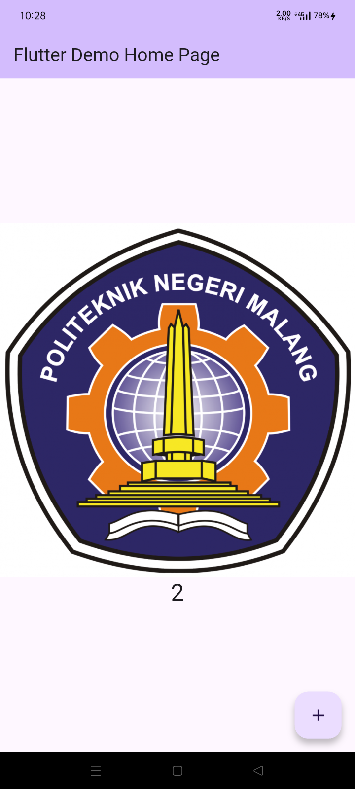
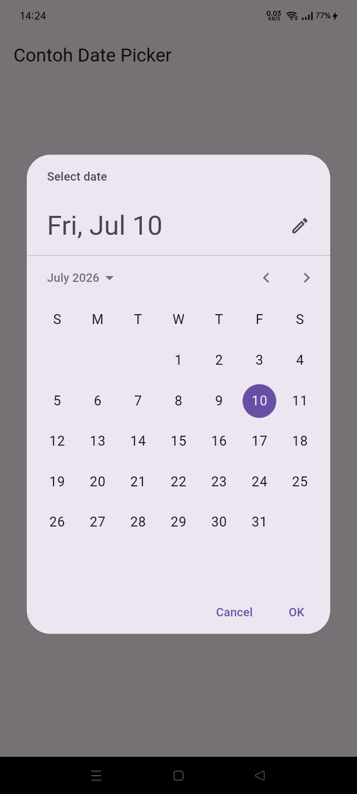

# hello_world

A new Flutter project.
Pratama Angga Saputra / 244107060113 / SIB 2 G

## Praktikum 1
Hasil akhir:

Hasil tersebut didapatkan setelah project flutter telah selesai terbuat. Template file dan folder akan ada dan akan muncul notifikasi keberhasilan di terminal.

## Praktikum 2
Langkah pertama:

Cari build number hp yang akan dihubungkan

Langkah kedua:

Cari developer option di setting dan aktifkan debugging usb

Langkah ketiga:

Pastikan sudah menginstal sdk berikut

Langkah keempat:

Di vs code, pilih device kita lalu kode tinggal di run seperti biasa

## Praktikum 3
Hasil akhir:

Hasil tersebut didapatkan setelah aplikasi berhasil jalan di hp

## Praktikum 4
Hasil akhir:

Hasil tersebut didapatkan ketika berhasil memasukan widget image kedalam aplikasi

## Praktikum 5
Hasil akhir:

Hasil akhir didapatkan ketika praktikum 5 selesai di langkah 6

