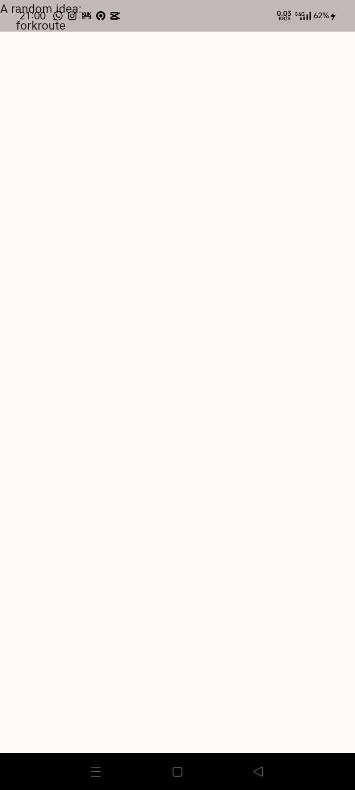
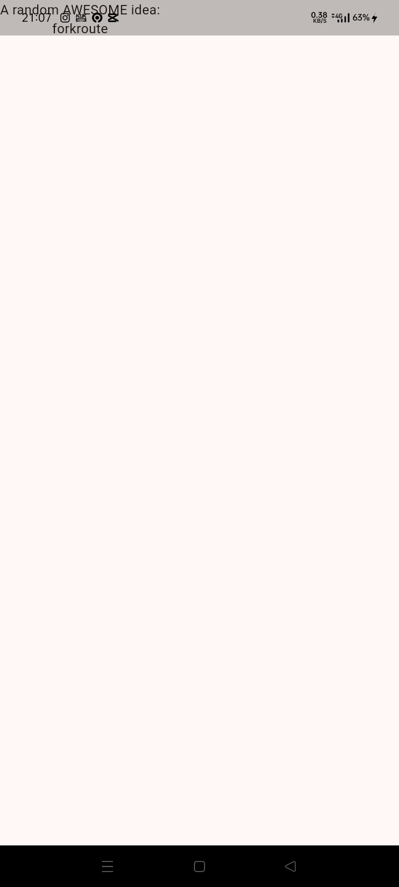
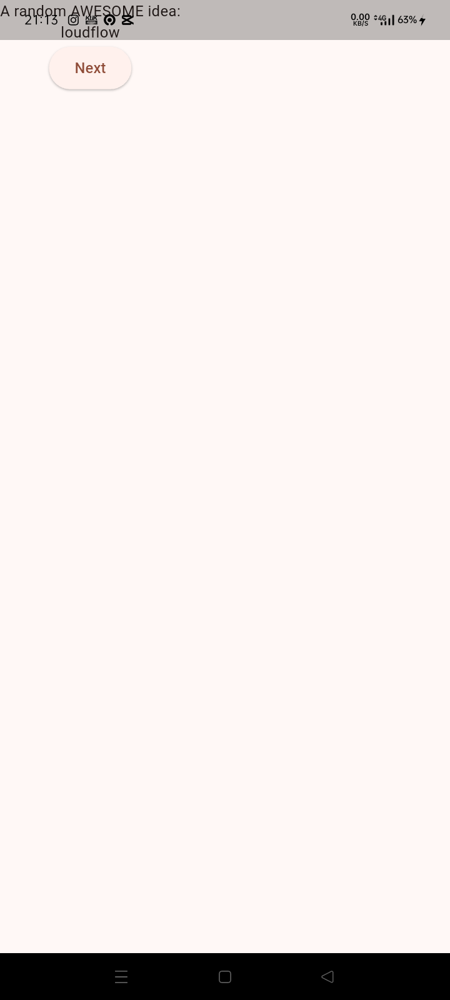
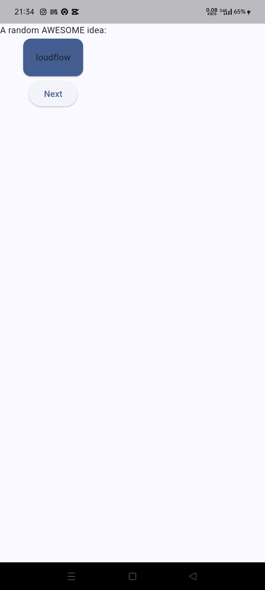
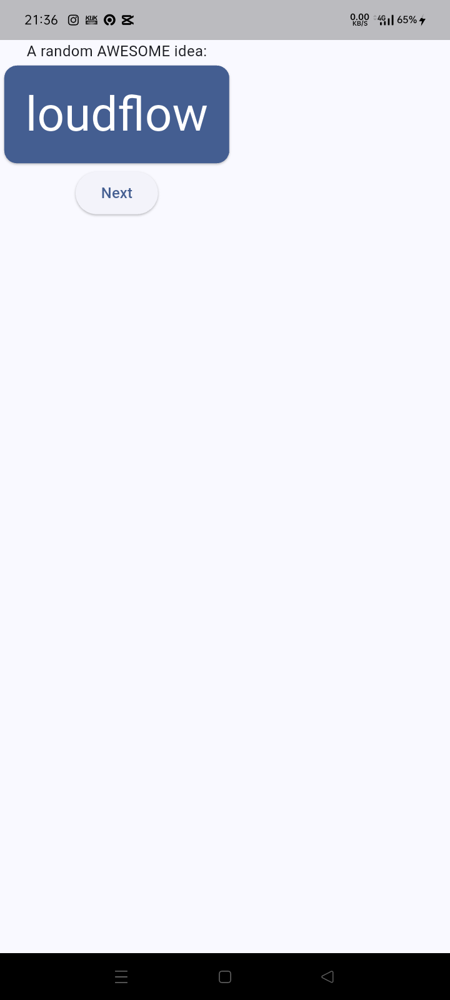
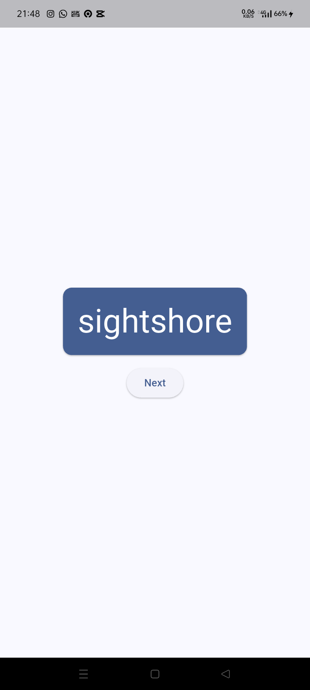
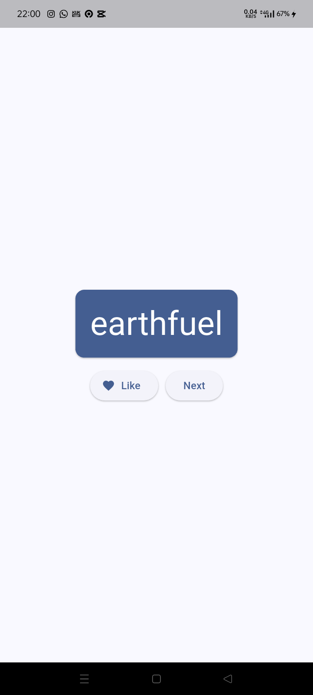
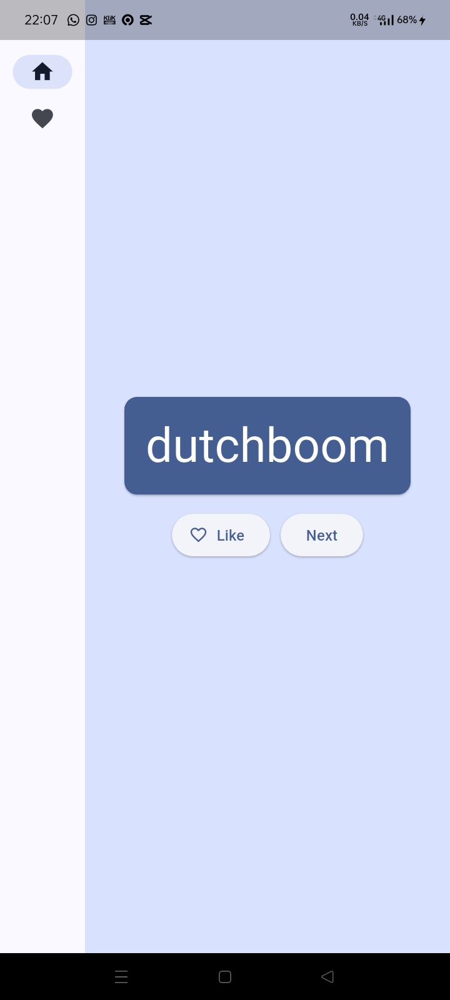
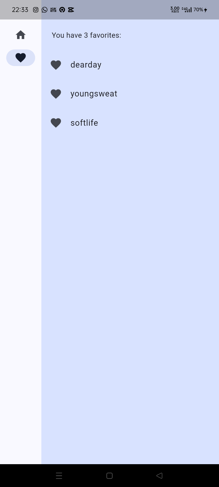

# flutter_application_1

A new Flutter project.

## Bab: Membuat project

Pertama kali run setelah projek dibuat

## Bab: Menambahkan tombol

Belajar menambahkan button

## Bab: Styling tampilan app

Hasil dari belajar memperindah tampilan aplikasi

## Bab: Menambahkan fungsi

Belajar menambahkan fungsi logika untuk tombol like

## Bab: Menambahkan kolom navigasi

Membuat navigasi samping dan tombol ke halaman baru

## Bab: Menambahkan halaman baru

Membuat halaman favorit